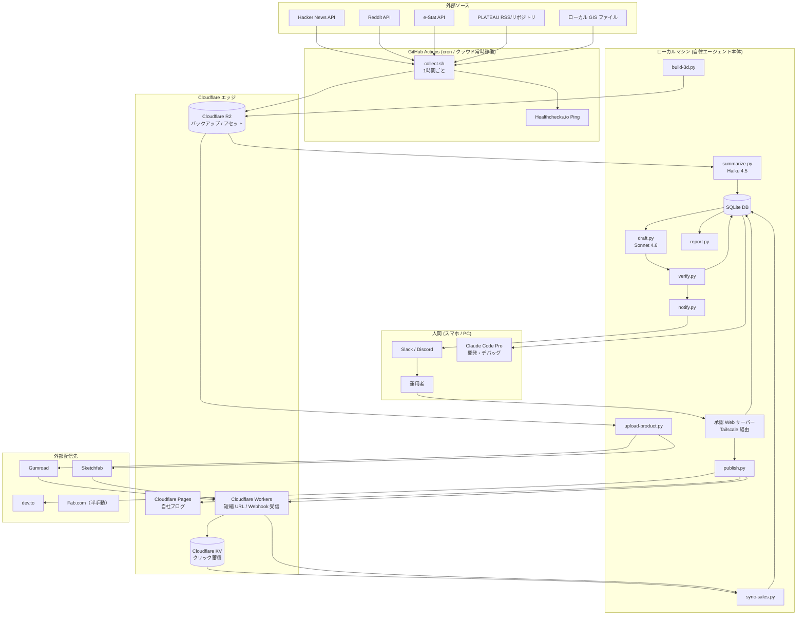
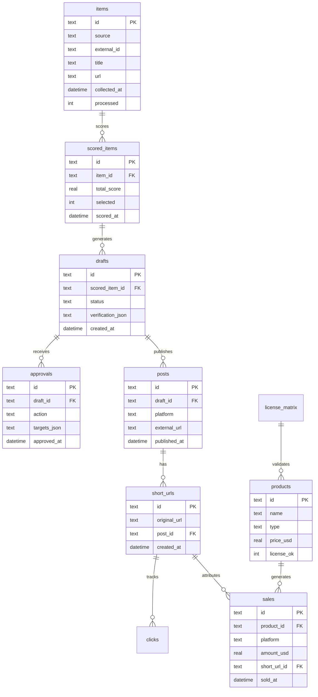
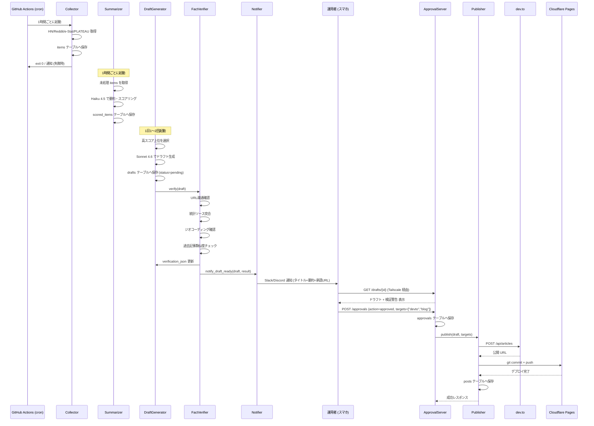
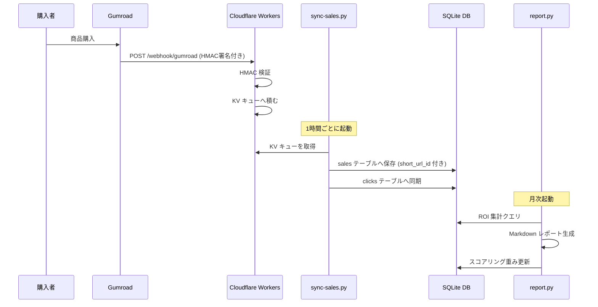
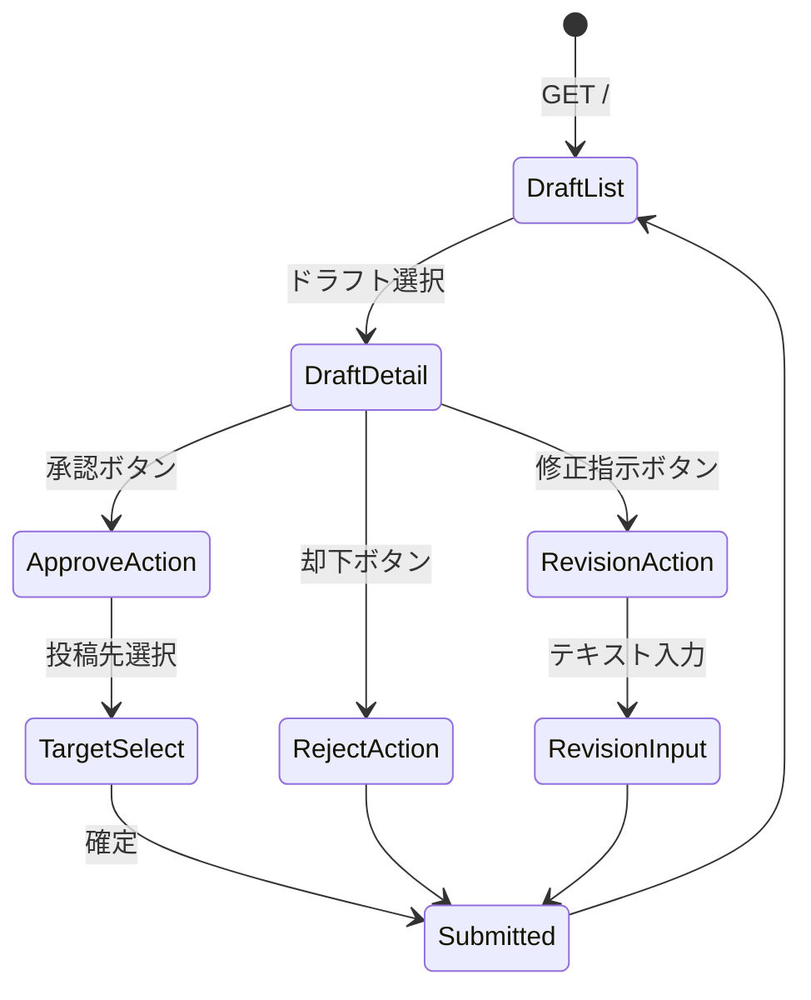

# 機能設計書 (Functional Design Document)

## システム構成図



---

## 技術スタック

| 分類 | 技術 | 選定理由 |
|------|------|----------|
| 自律エージェント言語 | Python 3.12 | 科学・GIS・AI ライブラリが充実、スクリプト実行に適する |
| 承認 Web サーバー | Python + FastAPI | 軽量・型安全・非同期対応、単一プロセスで起動 |
| Cloudflare Workers | TypeScript (Wrangler) | エッジ実行、KV/R2 との親和性、無料枠が大きい |
| 自社ブログ | Astro + Cloudflare Pages | SSG で高速、Markdown 投稿が容易 |
| データベース | SQLite (local) | 依存ゼロ・単一ファイル・個人運用スケールで十分 |
| ストレージ / バックアップ | Cloudflare R2 | 無料枠大、S3 互換 API |
| KV（クリック蓄積） | Cloudflare KV | エッジでのカウンタ書き込みに最適 |
| AI（一次処理） | Claude Haiku 4.5 | 低コスト・高速、要約・スコアリング向き |
| AI（記事生成） | Claude Sonnet 4.6 | 品質・コストのバランス最良、英語ライティング向き |
| 3D 変換 | Blender 4.x (bpy headless) | OSS・Python API 完備・最も普及した 3D ツール |
| CityGML パーサー | citygml-tools / py3dtiles | PLATEAU CityGML の Java/Python パーサー |
| シークレット管理 | pass (GPG) / 1Password CLI | `.env` 直書き禁止、スクリプトから呼び出し可能 |
| VPN | Tailscale | 承認サーバーを公開 IP に晒さずスマホからアクセス |
| CI/CD | GitHub Actions | cron トリガー・無料枠あり・ローカル停止時も稼働継続 |
| 監視 | Healthchecks.io | シンプルな Ping 監視、欠落でメール通知 |

---

## データモデル定義

### SQLite スキーマ全体

```sql
-- 収集した生データ
CREATE TABLE items (
    id          TEXT PRIMARY KEY,          -- UUID v4
    source      TEXT NOT NULL,             -- 'hacker_news'|'reddit'|'estat'|'plateau'|'local_file'
    external_id TEXT,                      -- ソース側の ID
    title       TEXT,
    url         TEXT,
    content     TEXT,                      -- 本文・概要テキスト
    raw_json    TEXT,                      -- ソースからの生 JSON
    collected_at DATETIME NOT NULL,
    processed   INTEGER DEFAULT 0          -- 0=未処理, 1=処理済
);

-- スコアリング済みアイテム
CREATE TABLE scored_items (
    id               TEXT PRIMARY KEY,
    item_id          TEXT NOT NULL REFERENCES items(id),
    summary_ja       TEXT,                 -- Haiku 生成の日本語要約（内部用）
    summary_en       TEXT,                 -- Haiku 生成の英語要約
    relevance_score  REAL,                 -- 0-100: geo/3D/viz キーワード適合度
    novelty_score    REAL,                 -- 0-100: 過去記事との非類似度
    potential_score  REAL,                 -- 0-100: ソースの反響・重要度
    total_score      REAL,                 -- 加重平均スコア
    scored_at        DATETIME NOT NULL,
    selected         INTEGER DEFAULT 0     -- 0=未選択, 1=記事生成対象
);

-- 記事ドラフト
CREATE TABLE drafts (
    id                  TEXT PRIMARY KEY,
    scored_item_id      TEXT NOT NULL REFERENCES scored_items(id),
    title               TEXT,
    content_md          TEXT,              -- Markdown 本文
    frontmatter_json    TEXT,              -- dev.to 用フロントマター JSON
    status              TEXT DEFAULT 'pending',
                                           -- 'pending'|'approved'|'rejected'|'published'
    verification_json   TEXT,              -- 検証結果 JSON
    revision_note       TEXT,              -- 修正指示テキスト
    created_at          DATETIME NOT NULL,
    updated_at          DATETIME NOT NULL
);

-- 承認記録
CREATE TABLE approvals (
    id           TEXT PRIMARY KEY,
    draft_id     TEXT NOT NULL REFERENCES drafts(id),
    action       TEXT NOT NULL,            -- 'approved'|'rejected'|'revision_requested'
    targets_json TEXT,                     -- JSON 配列: ["devto","blog"]
    revision_note TEXT,
    approved_at  DATETIME NOT NULL
);

-- 投稿済み記事
CREATE TABLE posts (
    id           TEXT PRIMARY KEY,
    draft_id     TEXT NOT NULL REFERENCES drafts(id),
    platform     TEXT NOT NULL,            -- 'devto'|'blog'
    external_url TEXT,
    short_url_id TEXT REFERENCES short_urls(id),
    published_at DATETIME NOT NULL
);

-- 短縮 URL
CREATE TABLE short_urls (
    id           TEXT PRIMARY KEY,         -- 短縮コード (例: "a1b2c3")
    original_url TEXT NOT NULL,
    post_id      TEXT REFERENCES posts(id),
    created_at   DATETIME NOT NULL
);

-- クリック数 (Cloudflare KV から 1 時間ごと同期)
CREATE TABLE clicks (
    id           TEXT PRIMARY KEY,
    short_url_id TEXT NOT NULL REFERENCES short_urls(id),
    clicked_at   DATETIME NOT NULL,
    country      TEXT
);

-- 商品
CREATE TABLE products (
    id              TEXT PRIMARY KEY,
    name            TEXT NOT NULL,
    type            TEXT NOT NULL,         -- 'visualization_template'|'3d_asset'
    price_usd       REAL,
    platforms_json  TEXT,                  -- JSON 配列: ["gumroad","sketchfab"]
    status_json     TEXT,                  -- JSON: {"gumroad":"uploaded","sketchfab":"pending"}
    license_ok      INTEGER DEFAULT 0,     -- ライセンス検証通過フラグ
    created_at      DATETIME NOT NULL
);

-- 売上
CREATE TABLE sales (
    id           TEXT PRIMARY KEY,
    product_id   TEXT NOT NULL REFERENCES products(id),
    platform     TEXT NOT NULL,            -- 'gumroad'|'fab'|'sketchfab'|'stripe'
    amount_usd   REAL NOT NULL,
    currency     TEXT NOT NULL,
    short_url_id TEXT REFERENCES short_urls(id),
    sold_at      DATETIME NOT NULL
);

-- 検証済みソース (事実検証ゲート用)
CREATE TABLE verified_sources (
    id               TEXT PRIMARY KEY,
    url              TEXT NOT NULL,
    title            TEXT,
    publication_date DATE,
    stat_year        INTEGER,
    data_type        TEXT,                 -- 'statistic'|'coordinate'|'reference'
    verified_at      DATETIME NOT NULL
);

-- ライセンスマトリクス
CREATE TABLE license_matrix (
    id           TEXT PRIMARY KEY,
    source_name  TEXT NOT NULL,            -- 'plateau'|'estat'|'kokudo_chiriin'|'osm'
    license_type TEXT NOT NULL,            -- 'CC BY 4.0'|'Government Standard 2.0'|'ODbL'
    commercial_ok INTEGER NOT NULL,        -- 0=不可, 1=可
    requires_attribution INTEGER NOT NULL,
    share_alike  INTEGER NOT NULL,         -- ODbL 等
    notes        TEXT,
    last_checked DATE NOT NULL
);
```

### ER 図



---

## コンポーネント設計

### 1. Collector（データ収集）

**責務**: 各外部ソースからデータを取得し `items` テーブルへ書き込む

```python
class BaseCollector:
    def collect(self) -> list[dict]: ...
    def save_to_db(self, items: list[dict]) -> int: ...

class HackerNewsCollector(BaseCollector):
    def collect(self) -> list[dict]: ...   # /topstories + /item/{id} API

class RedditCollector(BaseCollector):
    SUBREDDITS = ['gamedev', 'Unity3D', 'unrealengine', 'blender', 'gis', 'vrchat']
    def collect(self) -> list[dict]: ...

class EStatCollector(BaseCollector):
    def collect(self) -> list[dict]: ...   # e-Stat API v3

class PlateauFeedCollector(BaseCollector):
    FEEDS: list[str]                       # RSS/Atom URL リスト
    def collect(self) -> list[dict]: ...

class LocalFileCollector(BaseCollector):
    WATCH_DIR: Path
    def collect(self) -> list[dict]: ...   # inotify / polling で変更検知
```

**依存関係**: `requests`, `feedparser`, `watchdog`, SQLite

---

### 2. Summarizer（要約・スコアリング）

**責務**: 未処理 `items` を Haiku 4.5 で要約・スコアリングし `scored_items` へ書き込む

```python
class Summarizer:
    def process_pending(self, limit: int = 50) -> int: ...
    def summarize(self, item: dict) -> ScoredItem: ...
    def calculate_score(self, item: dict, summary: str) -> tuple[float, float, float]: ...

class ScoringEngine:
    def relevance_score(self, text: str) -> float: ...   # キーワード適合度
    def novelty_score(self, text: str) -> float: ...     # 過去記事との TF-IDF 類似度
    def potential_score(self, item: dict) -> float: ...  # ソース重要度
    def total_score(self, r: float, n: float, p: float) -> float: ...
```

**依存関係**: `anthropic` SDK, `scikit-learn`（TF-IDF）, SQLite

---

### 3. DraftGenerator（記事ドラフト生成）

**責務**: 高スコアアイテムを Sonnet 4.6 で英語記事ドラフトに変換し `drafts` へ保存

```python
class DraftGenerator:
    def generate_daily(self, count: int = 2) -> list[str]: ...  # draft ID リスト
    def generate(self, scored_item: ScoredItem) -> Draft: ...
    def build_system_prompt(self) -> str: ...
    def build_user_prompt(self, item: ScoredItem, competitors: list[str]) -> str: ...
    def search_competitors(self, keywords: list[str]) -> list[str]: ...
```

**システムプロンプト要件**:
- 断定できない箇所は `I assume` / `It appears that` で限定すること
- 出典 URL・統計年度・地名・コード例を必ず含めること
- dev.to フロントマター（tags, title, description, cover_image）を含めること

**依存関係**: `anthropic` SDK, SQLite

---

### 4. FactVerifier（事実検証ゲート）

**責務**: ドラフトの URL 到達性・統計年度・地名・重複を自動検証する

```python
class FactVerifier:
    def verify(self, draft: Draft) -> VerificationResult: ...
    def check_urls(self, content: str) -> list[UrlCheckResult]: ...
    def check_sources(self, content: str) -> list[SourceCheckResult]: ...
    def check_geocoding(self, content: str) -> list[GeoCheckResult]: ...
    def check_similarity(self, content: str) -> float: ...   # コサイン類似度

class VerificationResult:
    all_passed: bool
    url_failures: list[str]
    source_mismatches: list[str]
    geo_failures: list[str]
    similarity_score: float            # 0-1、0.85 超で警告
    warnings: list[str]
```

**依存関係**: `httpx`（URL チェック）, `geopy`（ジオコーディング）, `scikit-learn`（類似度）, SQLite

---

### 5. Notifier（通知）

**責務**: 検証済みドラフトを Slack / Discord Webhook でスマホ通知する

```python
class Notifier:
    def notify_draft_ready(self, draft: Draft, result: VerificationResult) -> None: ...
    def notify_publish_error(self, draft_id: str, error: str) -> None: ...
    def build_message(self, draft: Draft, result: VerificationResult) -> dict: ...
```

**通知メッセージ構成**:
```
📝 [タイトル]
───────────────
[要約 2-3 文]
───────────────
⚠️ 警告: [検証警告があれば表示]
───────────────
🔗 承認URL: https://[tailscale-ip]:8080/drafts/[id]
```

---

### 6. ApprovalServer（承認 Web サーバー）

**責務**: Tailscale 経由でスマホから承認操作を受け付け、`approvals` テーブルに記録する

```python
app = FastAPI()

@app.get("/drafts/{draft_id}")
async def get_draft(draft_id: str) -> DraftResponse: ...

@app.post("/approvals")
async def submit_approval(body: ApprovalRequest) -> ApprovalResponse: ...
    # action: 'approved' → publish.py をトリガー
    # action: 'rejected' → drafts.status = 'rejected'
    # action: 'revision_requested' → drafts.revision_note 更新 + 再生成キュー

@app.get("/health")
async def health() -> dict: ...
```

**バインド設定**: `--host 0.0.0.0 --port 8080`（Tailscale 100.x.x.x のみ到達可能）

---

### 7. Publisher（投稿）

**責務**: 承認されたドラフトを dev.to と自社ブログへ投稿し、`posts` テーブルに記録する

```python
class Publisher:
    def publish(self, draft: Draft, targets: list[str]) -> list[Post]: ...

class DevToPublisher:
    def publish(self, draft: Draft) -> Post: ...   # POST /api/articles
    def replace_with_short_urls(self, content: str) -> str: ...

class BlogPublisher:
    def publish(self, draft: Draft) -> Post: ...   # git commit + push → CF Pages
    def create_markdown_file(self, draft: Draft) -> Path: ...

class URLShortenerClient:
    def shorten(self, url: str, post_id: str) -> str: ...   # CF Workers API
```

**リトライ設計**: 最大 3 回、指数バックオフ（1s, 4s, 16s）、全失敗時は `notify_publish_error()`

---

### 8. SalesTracker（売上追跡）

**責務**: 販売 Webhook を受信し、短縮 URL クリックを同期して `sales` / `clicks` テーブルに保存する

```python
# Cloudflare Workers (TypeScript) - webhook受信 + クリック集計
export default {
  async fetch(request: Request, env: Env): Promise<Response> {
    if (request.method === 'POST' && url.pathname.startsWith('/webhook/')) {
      return handleWebhook(request, env);
    }
    if (url.pathname.startsWith('/r/')) {
      return handleRedirect(request, env);   // クリックカウント + リダイレクト
    }
  }
}

# sync-sales.py - KV → SQLite 同期
class SalesSyncer:
    def sync_clicks(self) -> int: ...         # CF KV → SQLite clicks テーブル
    def process_webhook_queue(self) -> int: ... # CF KV キューから売上処理
    def verify_hmac(self, payload: bytes, sig: str) -> bool: ...
```

---

### 9. ReportGenerator（レポート生成）

**責務**: 月次 ROI レポートを生成し、次回スコアリングの重み付けを更新する

```python
class ReportGenerator:
    def generate_monthly(self, year: int, month: int) -> Report: ...
    def source_roi(self) -> list[SourceROI]: ...     # ソース別クリック・売上
    def topic_roi(self) -> list[TopicROI]: ...       # トピック別効果
    def product_roi(self) -> list[ProductROI]: ...   # 商品別 ROI
    def update_scoring_weights(self, report: Report) -> None: ...
```

---

### 10. ThreeDPipeline（3D 変換パイプライン）

**責務**: PLATEAU CityGML を Blender で FBX / glTF / USD に変換し、マーケット向けパックを生成する

```python
class ThreeDPipeline:
    def build(self, area: str, lod: int) -> ProductBundle: ...
    def parse_citygml(self, path: Path) -> CityModel: ...
    def convert_blender(self, model: CityModel) -> list[Path]: ...  # headless bpy
    def generate_lod(self, mesh: Path, levels: list[int]) -> list[Path]: ...
    def atlas_textures(self, mesh: Path) -> Path: ...
    def render_promo(self, scene: Path) -> list[Path]: ...          # Cycles レンダー
    def validate_unity(self, fbx: Path) -> bool: ...                # Unity CLI -batchmode
    def package(self, assets: list[Path], area: str) -> Path: ...   # ZIP 生成
    def check_license(self, sources: list[str]) -> LicenseResult: ...
```

---

### 11. LicenseValidator（ライセンス検証）

**責務**: 商品に使用するデータソースが販売許可済みのライセンスのみ含むか CI で検証する

```python
class LicenseValidator:
    def validate(self, product_sources: list[str]) -> LicenseResult: ...
    def is_commercial_ok(self, source: str) -> bool: ...
    def generate_attribution(self, sources: list[str]) -> str: ...
    def generate_license_md(self, sources: list[str]) -> str: ...
```

---

## ユースケース図

### UC-1: 記事ドラフト生成〜承認〜投稿



### UC-2: 売上記録〜月次レポート



---

## 承認 Web UI 設計

### 画面遷移図



### 承認画面の表示項目

| 項目 | 内容 |
|------|------|
| タイトル | ドラフトのタイトル |
| 要約 | AI 生成の 2-3 文要約 |
| 本文プレビュー | Markdown レンダリング（折りたたみ） |
| 検証結果 | ✅ 合格 / ⚠️ 警告（URL 不到達、類似度超過等）|
| アクション | 承認 / 却下 / 修正指示（テキスト入力付き） |

---

## API 設計

### 承認サーバー (FastAPI, Tailscale 限定)

#### GET /drafts/{draft_id}
```json
Response 200:
{
  "id": "uuid",
  "title": "Exploring Japan Open Data with deck.gl",
  "summary": "...",
  "content_md": "...",
  "verification": {
    "all_passed": false,
    "warnings": ["URL https://... returned 404"]
  },
  "created_at": "2026-05-27T09:00:00Z"
}
```

#### POST /approvals
```json
Request:
{
  "draft_id": "uuid",
  "action": "approved",
  "targets": ["devto", "blog"]
}

Response 200:
{
  "approval_id": "uuid",
  "status": "publishing"
}
```

### Cloudflare Workers (公開エンドポイント)

#### POST /webhook/gumroad
```
Header: X-Gumroad-Signature: <HMAC-SHA256>
Body: Gumroad Webhook JSON
Response: 200 OK
```

#### GET /r/{short_code}
```
Response: 302 Redirect to original_url
(クリック数を KV にインクリメント)
```

---

## スコアリングアルゴリズム

### トピック選定スコア計算

**目的**: 収集したアイテムから記事化すべきものを優先順位付けする

#### ステップ1: 関連性スコア（0-100点）

- geo / GIS / 3D / visualization / Japan / PLATEAU 等のキーワードとの TF-IDF 一致度
- 計算式: `min(tf_idf_cosine_sim(text, keyword_corpus) * 100, 100)`

#### ステップ2: 新規性スコア（0-100点）

- 過去 `posts` テーブルの記事本文との最大コサイン類似度の逆数
- 計算式: `(1 - max_similarity) * 100`（類似度 0.5 以上でスコア 50 以下）

#### ステップ3: ポテンシャルスコア（0-100点）

| ソース | 基準 | 計算 |
|--------|------|------|
| Hacker News | HN スコア | `min(hn_score / 5, 100)` |
| Reddit | upvotes | `min(upvotes / 2, 100)` |
| PLATEAU | リリース種別 | 新データセット=100, 更新=70, アナウンス=40 |
| e-Stat | 更新頻度 | 年次=60, 月次=80, 速報=100 |
| ローカルファイル | ファイルサイズ | `min(size_mb * 10, 100)` |

#### ステップ4: 総合スコア

```
total_score = relevance_score × 0.40
            + novelty_score   × 0.35
            + potential_score × 0.25
```

**選定閾値**: `total_score >= 60` のアイテムのみ記事生成対象とする

---

## ファイル構造

```
geo-autonome/
├── agents/                    # 自律エージェントスクリプト群
│   ├── collect.sh             # 収集エントリーポイント
│   ├── collectors/
│   │   ├── hacker_news.py
│   │   ├── reddit.py
│   │   ├── estat.py
│   │   ├── plateau_feed.py
│   │   └── local_file.py
│   ├── summarize.py
│   ├── draft.py
│   ├── verify.py
│   ├── notify.py
│   ├── publish.py
│   ├── sync_sales.py
│   ├── report.py
│   ├── build_3d.py
│   └── upload_product.py
├── approval/                  # 承認 Web サーバー (FastAPI)
│   ├── main.py
│   ├── routers/
│   └── templates/
├── workers/                   # Cloudflare Workers (TypeScript)
│   ├── short_url/
│   │   ├── src/index.ts
│   │   └── wrangler.toml
│   └── webhook/
│       ├── src/index.ts
│       └── wrangler.toml
├── blog/                      # 自社ブログ (Astro)
│   ├── src/
│   └── astro.config.mjs
├── pipeline/                  # 3D 変換パイプライン
│   ├── blender_scripts/
│   └── unity_scripts/
├── data/                      # ローカルデータ
│   ├── geo_autonome.db        # SQLite
│   └── license_matrix.csv
├── .github/
│   └── workflows/
│       ├── collect.yml        # 1時間ごと cron
│       └── license_check.yml  # 商品ビルド時 CI
└── docs/
```

---

## エラーハンドリング

### 終了コード体系（全スクリプト共通）

| コード | 意味 | 処理 |
|-------|------|------|
| `0` | 正常終了 | Healthchecks.io に Ping |
| `1` | 一般エラー（設定・入力） | エラーログ出力、Healthchecks.io に失敗通知 |
| `2` | 外部 API エラー | 3 回リトライ後、スマホ通知 |
| `3` | 認証・権限エラー | 即時失敗、スマホ通知（シークレット失効の可能性） |
| `4` | データファイルエラー | R2 バックアップから復元試行後、スマホ通知 |
| `5` | 3D パイプラインエラー | エラーログ保存、スマホ通知 |
| `6` | 検証ゲートエラー | drafts.status = 'verification_failed'、承認画面に警告表示 |

### エラー種別と処理

| エラー種別 | 処理 | ユーザーへの表示 |
|-----------|------|-----------------|
| API レート制限 | 指数バックオフでリトライ（最大3回） | 承認画面に "API rate limit, retrying" |
| SQLite ロック | 500ms 待機後リトライ（最大 5 回） | ログのみ |
| URL 到達不能（検証） | verification_json に記録し警告表示 | 承認画面に ⚠️ バッジ |
| 類似度閾値超過 | verification_json に記録し警告表示 | 承認画面に ⚠️ バッジ |
| dev.to 投稿失敗 | 3 回リトライ後、スマホ通知 | "Failed to publish to dev.to" |
| Blender クラッシュ | ログ保存、スマホ通知 | "3D pipeline failed for [area]" |

---

## パフォーマンス最適化

- **バッチ処理**: Summarizer は 1 回の起動で最大 50 件を処理し、Haiku 4.5 を並列呼び出し（rate limit 内）
- **ドラフト生成の並列化**: 1 日分のドラフト 2 本を非同期で並列生成
- **SQLite WAL モード**: 読み取り/書き込みの競合を最小化
- **CF Workers キャッシュ**: 短縮 URL リダイレクトを KV キャッシュで高速化（TTL: 1 時間）
- **差分収集**: `items.external_id` と `collected_at` を使い重複収集をスキップ

---

## セキュリティ考慮事項

- **シークレット管理**: `pass` (GPG) または `op run --` (1Password CLI) でスクリプト実行時に注入、`.env` 直書き禁止
- **承認サーバー**: Tailscale IP レンジ（100.x.x.x）以外の接続を FastAPI ミドルウェアで拒否
- **Webhook 検証**: Gumroad・Sketchfab からの Webhook は HMAC-SHA256 署名を必ず検証し、不一致時は 401 を返す
- **R2 アクセス制御**: バケットポリシーで read を Workers のみに限定
- **SQLite バックアップ**: 毎日 Cloudflare R2 へ暗号化アップロード（AES-256）

---

## テスト戦略

### ユニットテスト
- `ScoringEngine`: 各スコア計算関数のエッジケース
- `FactVerifier`: モック HTTP レスポンスでの URL チェック
- `LicenseValidator`: ライセンスマトリクス CSV のパースと判定ロジック
- `URLShortener`: 短縮コード生成の衝突回避

### 統合テスト
- SQLite スキーママイグレーション
- Collector → Summarizer → DraftGenerator の E2E フロー（ローカル DB 使用）
- ApprovalServer: TestClient で承認フロー全体

### E2E テスト
- Cloudflare Workers: `wrangler dev` でリダイレクト + クリック記録
- ドラフト生成 → 承認 → dev.to 投稿のサンドボックス確認（dev.to draft モード使用）
