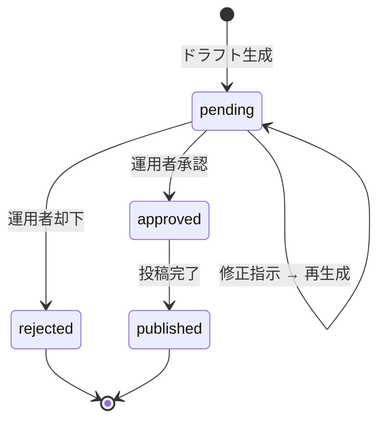

# プロジェクト用語集 (Glossary)

## 概要

このドキュメントは、GeoAutonome プロジェクト内で使用される用語の定義を管理します。
全ドキュメントで用語の意味が統一されるよう、実装前に本用語集を確認すること。

**更新日**: 2026-05-27

---

## ドメイン用語

### GeoAutonome（ジオ・オートノーム）

**定義**: 本プロジェクトのシステム名称。24時間自律稼働型・地理空間データマネタイズシステム。

**説明**: 個人開発者が日本の公的オープンデータ（PLATEAU・e-Stat 等）を海外開発者向けに加工・配布し、収益化するための自律エージェントシステム。Claude API（Haiku 4.5 / Sonnet 4.6）を自律エージェントの中核とし、Claude Code Pro は運用者の開発支援に専用利用する。

**関連用語**: [自律エージェント](#自律エージェント-autonomous-agent), [AI処理二系統分離](#ai処理二系統分離)

**英語表記**: GeoAutonome

---

### 自律エージェント (Autonomous Agent)

**定義**: 人間の介入なしに 24 時間稼働し、データ収集・要約・記事生成・事実検証・通知の一連処理を自動実行するプログラム群。

**説明**: `agents/` ディレクトリ以下のスクリプト群がこれに相当する。GitHub Actions の cron ジョブ（収集）とローカル PC の常時プロセス（要約・生成・検証・通知）で構成される。人間の関与は承認操作のみ。

**関連用語**: [スマホ承認フロー](#スマホ承認フロー-mobile-approval-flow), [AI処理二系統分離](#ai処理二系統分離)

**実装箇所**: `agents/`

**英語表記**: Autonomous Agent

---

### AI処理二系統分離

**定義**: Claude Code Pro（月額固定・人間専用）と Claude API（従量課金・エージェント専用）を完全に分離する設計方針。

**説明**: Claude Code Pro は週次利用上限があるため、24/7 稼働の自律エージェントに使用すると全停止リスクがある。この問題を回避するために、クレデンシャル・課金プールを分離する。

| 系統 | モデル | 用途 | 課金 |
|------|--------|------|------|
| 系統A | Claude Code Pro | 開発・デバッグ・記事レビュー | 月額 $20 |
| 系統B | Claude Haiku 4.5 | 要約・スコアリング・重複排除 | 従量課金 |
| 系統B | Claude Sonnet 4.6 | 英語記事ドラフト生成 | 従量課金 |

**関連用語**: [自律エージェント](#自律エージェント-autonomous-agent), [プロンプトキャッシュ](#プロンプトキャッシュ-prompt-caching)

---

### スマホ承認フロー (Mobile Approval Flow)

**定義**: 自律エージェントが生成したドラフトを、運用者がスマートフォンから 1 クリックで承認・却下・修正指示できる仕組み。

**説明**: ドラフト完成時に Slack / Discord Webhook でスマホ通知が届く。運用者は Tailscale 経由で承認 Web サーバーにアクセスし、3 つのアクション（承認・却下・修正指示）を選択する。承認後は `publish.py` が自動で投稿処理を実行する。

**成功指標**: Phase 2 終了時点で承認 1 クリック達成率 70% 以上（[承認1クリック達成率](#承認1クリック達成率)参照）

**関連用語**: [承認記録 (Approval)](#承認記録-approval), [承認Webサーバー](#承認webサーバー-approval-server)

**実装箇所**: `approval/main.py`

---

### 承認1クリック達成率

**定義**: スマホ通知から実際の投稿・販売完了まで、人間の追加修正なしで完了できた割合（%）。

**計算方法**: `(修正なし承認数 / 全承認数) × 100`

**目標値**: Phase 2 終了時点で 70% 以上

**計測方法**: SQLite の `approvals` テーブルの `action = 'approved'` 件数と、その後に `revision_requested` が続かなかった件数から算出。

**関連用語**: [スマホ承認フロー](#スマホ承認フロー-mobile-approval-flow)

---

### 副商品（可視化テンプレ）

**定義**: Phase 1〜2 で早期売上を獲得するための低単価商品。Observable Notebook / deck.gl / D3 / Mapbox 等の可視化コードテンプレート。

**説明**: 「日本のオープンデータを使った具体的な可視化サンプル」を求める海外フロントエンド開発者向け。主なチャネルは Gumroad。価格帯は $19〜$29。

**関連用語**: [主力商品](#主力商品3d資産パック), [Gumroad](#gumroad)

**英語表記**: Visualization Template

---

### 主力商品（3D資産パック）

**定義**: Phase 3 以降で継続収益を生む高単価商品。PLATEAU 由来の日本都市 3D モデルを Unity / UE5 / Blender で使える形式に変換したもの。

**説明**: 「日本の都市を題材にしたゲーム・VR コンテンツを作りたい海外開発者」がターゲット。Fab.com / Sketchfab / Gumroad で販売。最初の商品は「Osaka Dotonbori Night Scene」（$29）を想定。

**関連用語**: [副商品](#副商品可視化テンプレ), [3Dパイプライン](#3dパイプライン-3d-pipeline), [PLATEAU](#plateau)

**英語表記**: 3D Asset Pack

---

### ネタ選定スコア (Topic Selection Score)

**定義**: 収集したアイテムを記事化すべきか判断するための合成スコア（0〜100点）。

**計算式**:
```
total_score = relevance_score × 0.40
            + novelty_score   × 0.35
            + potential_score × 0.25
```

| 要素スコア | 定義 | 計算方法 |
|-----------|------|---------|
| `relevance_score` | 地理空間・3D・可視化トピックとの適合度 | 収集テキストと GEO_KEYWORDS のコサイン類似度 |
| `novelty_score` | 過去記事との差異（新規性） | `(1 - max_cosine_similarity) × 100` |
| `potential_score` | ソース固有の反響・重要度 | HN スコア・Reddit upvotes・PLATEAU リリース種別から算出 |

**選定閾値**: `total_score >= 60` のアイテムのみ記事生成対象

**実装箇所**: `agents/summarizers/scoring_engine.py`

**関連用語**: [収集アイテム (Item)](#収集アイテム-item), [スコアリング済みアイテム (ScoredItem)](#スコアリング済みアイテム-scoreditem)

---

### 短縮 URL (Short URL)

**定義**: 記事内の外部リンク（商品ページ等）を Cloudflare Workers で管理する自前の短縮 URL。クリック計測と販売経路特定に使用する。

**説明**: 承認済み記事の投稿時に `publish.py` がすべての外部リンクを短縮 URL に置換する。リダイレクト先の Cloudflare Workers がクリック数を KV に記録し、1 時間ごとに SQLite へ同期する。

**フォーマット**: `https://geo.example.com/r/{6文字コード}`

**実装箇所**: `workers/short-url/`

**関連用語**: [クリック記録 (Click)](#クリック記録-click), [Cloudflare Workers](#cloudflare-workers)

---

### 事実検証ゲート (Fact Verification Gate)

**定義**: 記事ドラフトが承認通知に送られる前に自動実行される 4 つの検証チェック。

**検証項目**:
1. **URL 疎通確認**: 記事内の引用 URL がすべて HTTP 200 で到達可能か
2. **統計ソース突合**: 統計年度・出典が `verified_sources` テーブルと一致するか
3. **ジオコーディング検証**: 地名・座標が実在するか（Nominatim API で確認）
4. **類似度チェック**: 過去記事とのコサイン類似度が 0.85 未満か

**結果**: 検証失敗項目はすべて承認画面に ⚠️ 警告として表示される（自動却下はしない）

**実装箇所**: `agents/verifiers/fact_verifier.py`

**関連用語**: [記事ドラフト (Draft)](#記事ドラフト-draft)

---

### ライセンスマトリクス (License Matrix)

**定義**: 使用するデータソース別のライセンス種別・商用可否・帰属義務を管理する CSV ファイル。

**説明**: 商品ビルド時の CI が「販売対象データソース ⊂ 承認済みソース」を自動チェックする。ODbL（OSM 派生データ）を含む商品は商用販売対象から自動除外する。

**管理ファイル**: `data/license_matrix.csv`

**主要エントリ**:

| ソース | ライセンス | 商用 OK | 帰属必要 | Share-Alike |
|--------|----------|---------|---------|-------------|
| PLATEAU | CC BY 4.0 | ✅ | ✅ | ❌ |
| e-Stat | 政府標準利用規約 2.0 | ✅ | ✅ | ❌ |
| 国土地理院 | 測量法（許諾あり） | 条件付き | ✅ | ❌ |
| OSM | ODbL | ❌ | ✅ | ✅ |

**実装箇所**: `pipeline/license_validator.py`

---

### 3Dパイプライン (3D Pipeline)

**定義**: PLATEAU の CityGML ファイルを Unity / UE5 / Blender で使える FBX / glTF / USD 形式に自動変換し、商品パックとしてパッケージングする処理フロー。

**処理ステップ**:
1. `citygml-tools` で CityGML をパース
2. Blender 4.x headless で FBX / glTF / USD に変換
3. Decimate Modifier で LOD（Level of Detail）を自動生成
4. テクスチャをアトラス化してファイルサイズ削減
5. Unity CLI (-batchmode) でロード成功を検証
6. Blender Cycles でプロモ用 360 度レンダー生成
7. `LICENSE.md` / `ATTRIBUTION.md` を自動生成して ZIP パッケージング

**実装箇所**: `pipeline/build_3d.py`, `pipeline/blender_scripts/`

**関連用語**: [PLATEAU](#plateau), [CityGML](#citygml), [LOD (Level of Detail)](#lod-level-of-detail)

---

## データモデル用語

### 収集アイテム (Item)

**定義**: 各外部ソースから取得した生データ 1 件を表すエンティティ。

**主要フィールド**:
- `id`: UUID v4
- `source`: データソース種別（`hacker_news` / `reddit` / `estat` / `plateau` / `local_file`）
- `external_id`: ソース側の一意 ID（重複収集防止に使用）
- `title`, `url`, `content`: 取得したコンテンツ
- `collected_at`: 収集日時
- `processed`: 要約処理済みフラグ（0 / 1）

**テーブル名**: `items`

**関連エンティティ**: [ScoredItem](#スコアリング済みアイテム-scoreditem)

---

### スコアリング済みアイテム (ScoredItem)

**定義**: `Item` を Claude Haiku 4.5 で要約・スコアリングした結果を表すエンティティ。

**主要フィールド**:
- `summary_en`: Haiku 生成の英語要約
- `relevance_score`, `novelty_score`, `potential_score`: 各要素スコア（0〜100）
- `total_score`: [ネタ選定スコア](#ネタ選定スコア-topic-selection-score) の加重平均
- `selected`: 記事生成対象に選択済みフラグ（0 / 1）

**テーブル名**: `scored_items`

**関連エンティティ**: [Item](#収集アイテム-item), [Draft](#記事ドラフト-draft)

---

### 記事ドラフト (Draft)

**定義**: Claude Sonnet 4.6 が生成した英語記事の未承認原稿を表すエンティティ。

**主要フィールド**:
- `content_md`: Markdown 本文
- `frontmatter_json`: dev.to 用フロントマター（tags / title / description）
- `status`: ドラフトの状態（下記参照）
- `verification_json`: 事実検証ゲートの結果
- `revision_note`: 修正指示テキスト

**テーブル名**: `drafts`

**status の状態遷移**:

| ステータス | 意味 | 遷移条件 | 次の状態 |
|----------|------|---------|---------|
| `pending` | 検証・承認待ち | ドラフト生成完了時 | `approved` / `rejected` |
| `approved` | 承認済み・投稿待ち | 運用者が承認 | `published` |
| `rejected` | 却下 | 運用者が却下 | （終端） |
| `published` | 投稿済み | 投稿処理完了 | （終端） |



**関連エンティティ**: [ScoredItem](#スコアリング済みアイテム-scoreditem), [Approval](#承認記録-approval), [Post](#投稿済み記事-post)

---

### 承認記録 (Approval)

**定義**: 運用者がドラフトに対して行った承認操作を記録するエンティティ。

**主要フィールド**:
- `action`: 操作種別（`approved` / `rejected` / `revision_requested`）
- `targets_json`: 投稿先のリスト（例: `["devto", "blog"]`）
- `revision_note`: 修正指示テキスト（`revision_requested` 時のみ）
- `approved_at`: 操作日時

**テーブル名**: `approvals`

---

### 投稿済み記事 (Post)

**定義**: 承認後に外部プラットフォームへ投稿された記事を表すエンティティ。

**主要フィールド**:
- `platform`: 投稿先（`devto` / `blog`）
- `external_url`: 投稿先の公開 URL
- `short_url_id`: 記事内の代表短縮 URL
- `published_at`: 公開日時

**テーブル名**: `posts`

---

### クリック記録 (Click)

**定義**: 短縮 URL 経由のリダイレクトを記録するエンティティ。Cloudflare KV から 1 時間ごとに同期される。

**主要フィールド**:
- `short_url_id`: クリックされた短縮 URL の ID
- `clicked_at`: クリック日時
- `country`: 国コード（ISO 3166-1 alpha-2、Cloudflare が付与）

**テーブル名**: `clicks`

**関連エンティティ**: [ShortURL](#短縮-url-short-url), [Sale](#売上-sale)

---

### 商品 (Product)

**定義**: Gumroad / Fab.com / Sketchfab で販売している商品を表すエンティティ。

**主要フィールド**:
- `type`: 商品種別（`visualization_template` / `3d_asset`）
- `price_usd`: 価格（USD）
- `platforms_json`: 販売プラットフォームリスト
- `status_json`: プラットフォーム別アップロード状態
- `license_ok`: ライセンス検証通過フラグ（0 / 1）

**テーブル名**: `products`

---

### 売上 (Sale)

**定義**: 各プラットフォームからの Webhook で記録された販売イベントを表すエンティティ。

**主要フィールド**:
- `platform`: 販売プラットフォーム（`gumroad` / `fab` / `sketchfab` / `stripe`）
- `amount_usd`: 販売額（USD）
- `short_url_id`: 購入につながった短縮 URL（販売経路の特定に使用）
- `sold_at`: 販売日時

**テーブル名**: `sales`

---

## 技術用語

### PLATEAU

**定義**: 国土交通省が主導する日本全国の 3D 都市モデルオープンデータプロジェクト。

**公式サイト**: https://www.mlit.go.jp/plateau/

**本プロジェクトでの用途**: 3D資産パック（主力商品）の主要データソース。CityGML 形式で提供されるビルデータを 3D パイプラインで FBX / glTF / USD に変換して販売する。

**ライセンス**: CC BY 4.0（出典明記が必須）

**関連用語**: [CityGML](#citygml), [3Dパイプライン](#3dパイプライン-3d-pipeline), [ライセンスマトリクス](#ライセンスマトリクス-license-matrix)

---

### CityGML

**定義**: 都市の 3D モデルを記述するための XML ベースのオープン標準フォーマット（OGC 標準）。

**本プロジェクトでの用途**: PLATEAU から取得した建築物・道路・植生データが CityGML 形式で提供される。`citygml-tools`（Java CLI）でパースし、Blender で変換する。

**バージョン**: CityGML 2.0（PLATEAU v2〜v3）、CityGML 3.0（PLATEAU v4 以降）

**関連用語**: [PLATEAU](#plateau), [LOD (Level of Detail)](#lod-level-of-detail)

---

### Claude Haiku 4.5

**定義**: Anthropic が提供する軽量・高速・低コストの Claude モデル。

**本プロジェクトでの用途**: 自律エージェントの一次処理（収集アイテムの要約・スコアリング・重複排除）に使用。1 バッチ最大 50 件を並列処理。

**利用系統**: Claude API（従量課金 / 系統B）

**関連用語**: [AI処理二系統分離](#ai処理二系統分離), [プロンプトキャッシュ](#プロンプトキャッシュ-prompt-caching)

---

### Claude Sonnet 4.6

**定義**: Anthropic が提供する品質とコストのバランスに優れた Claude モデル。

**本プロジェクトでの用途**: 自律エージェントの英語記事ドラフト生成・商品説明文生成に使用。1日 1〜2 本のドラフトを生成。

**利用系統**: Claude API（従量課金 / 系統B）

**関連用語**: [AI処理二系統分離](#ai処理二系統分離), [プロンプトキャッシュ](#プロンプトキャッシュ-prompt-caching)

---

### プロンプトキャッシュ (Prompt Caching)

**定義**: Anthropic SDK の機能で、同一のシステムプロンプトを繰り返し送信するコストを削減する仕組み。

**本プロジェクトでの用途**: `summarize.py` でシステムプロンプト（スコアリングルール・1,000 トークン超）をキャッシュし、バッチ処理でキャッシュ有効期間内に複数アイテムを処理してコスト削減。

**実装**: `cache_control: {"type": "ephemeral"}` を system フィールドに付与

**実装箇所**: `agents/summarizers/summarizer.py`

---

### Cloudflare Workers

**定義**: Cloudflare のエッジネットワーク上で JavaScript / TypeScript コードを実行できるサーバーレス実行環境（V8 Isolate ベース）。

**本プロジェクトでの用途**:
- `workers/short-url/`: 短縮 URL リダイレクト + KV クリック計測
- `workers/webhook/`: Gumroad / Sketchfab の販売 Webhook 受信

**制約**: CPU time 10ms / リクエスト（無料枠）、Python は実行不可

**関連用語**: [Cloudflare KV](#cloudflare-kv), [Cloudflare R2](#cloudflare-r2)

---

### Cloudflare KV

**定義**: Cloudflare Workers から利用できるグローバル分散 Key-Value ストレージ。

**本プロジェクトでの用途**:
- 短縮 URL クリックカウンタ（リアルタイム蓄積）
- Webhook 受信キュー（エッジ→ローカル間の非同期橋渡し）

**同期**: `sync_sales.py` が 1 時間ごとに KV → SQLite へ同期

**関連用語**: [Cloudflare Workers](#cloudflare-workers)

---

### Cloudflare R2

**定義**: S3 互換 API を持つ Cloudflare のオブジェクトストレージ。エグレス（転送）料金が無料。

**本プロジェクトでの用途**:
- GitHub Actions が収集した生データの一時保管
- SQLite DB の日次バックアップ（AES-256 暗号化後）
- 3D アセットマスターファイルの保管

**関連用語**: [Cloudflare Workers](#cloudflare-workers)

---

### Cloudflare Pages

**定義**: Git リポジトリと連携して静的サイトをデプロイする Cloudflare のホスティングサービス。

**本プロジェクトでの用途**: Astro で構築した自社英語ブログのホスティング。`publish.py` が記事 Markdown を git push すると自動デプロイされる。

---

### Tailscale

**定義**: WireGuard ベースの VPN サービス。デバイス間をプライベートネットワーク（CGNAT 100.x.x.x）で接続する。

**本プロジェクトでの用途**: 承認 Web サーバー（FastAPI）を公開 IP に晒さず、Tailscale 接続済みのスマホ・PC からのみアクセス可能にする。

**セキュリティ根拠**: `approval/middleware.py` が Tailscale IP レンジ（`100.x.x.x`）以外を 403 で拒否する。

**関連用語**: [承認Webサーバー](#承認webサーバー-approval-server)

---

### 承認Webサーバー (Approval Server)

**定義**: スマホからのドラフト承認操作を受け付ける FastAPI アプリケーション。Tailscale 経由でのみアクセス可能。

**エンドポイント**:
- `GET /drafts/{id}`: ドラフト詳細・検証結果の表示
- `POST /approvals`: 承認・却下・修正指示の送信

**実装箇所**: `approval/main.py`

**関連用語**: [Tailscale](#tailscale), [スマホ承認フロー](#スマホ承認フロー-mobile-approval-flow)

---

### Healthchecks.io

**定義**: cron ジョブの死活監視サービス。一定時間内に Ping がこなければメール通知を送る。

**本プロジェクトでの用途**: `collect.sh` 成功時に Ping を送信。1 時間以上 Ping が途絶えたら収集停止を通知。

---

### Merchant of Record (MoR)

**定義**: 顧客への販売において法的な「販売者」として振る舞い、VAT / 消費税の計算・徴収・申告を代行するサービスモデル。

**本プロジェクトでの用途**: Gumroad の MoR 機能を使用することで、海外顧客への販売時の VAT 対応を Gumroad に委託し、個人が直接税務処理する負担を回避する。

**関連用語**: [Gumroad](#gumroad)

---

### Gumroad

**定義**: デジタルコンテンツの販売に特化したプラットフォーム。Merchant of Record 機能を持つ。

**本プロジェクトでの用途**: 副商品（可視化テンプレ）の主要販売チャネル。Webhook で販売イベントを SQLite に記録する。

**関連用語**: [副商品](#副商品可視化テンプレ), [Merchant of Record (MoR)](#merchant-of-record-mor)

---

## アーキテクチャ用語

### パイプラインアーキテクチャ (Pipeline Architecture)

**定義**: データが複数の処理ステージを順番に通過するアーキテクチャパターン。各ステージは独立した責務を持ち、前ステージの出力が次ステージの入力になる。

**本プロジェクトでの適用**: 7 ステージのパイプラインを採用。

```
収集 → 要約/スコアリング → ドラフト生成 → 事実検証
     → スマホ通知 → 人間承認 → 投稿/計測
```

**各ステージの実装**:
- 収集: `agents/collect.sh`（GitHub Actions）
- 要約: `agents/summarize.py`（ローカル PC）
- 生成: `agents/draft.py`（ローカル PC）
- 検証: `agents/verify.py`（ローカル PC）
- 通知: `agents/notify.py`（ローカル PC）
- 投稿: `agents/publish.py`（ローカル PC）
- 計測: `agents/sync_sales.py`（ローカル PC）

---

### 終了コード体系 (Exit Code System)

**定義**: 全自律エージェントスクリプトが準拠する標準終了コードの定義。シェルスクリプト・GitHub Actions からの呼び出しでエラー種別を判別するために使用する。

**コード一覧**:

| コード | 意味 | 対応クラス |
|-------|------|-----------|
| `0` | 正常終了 | — |
| `1` | 一般エラー（設定・入力） | `GeoAutonomeError` |
| `2` | 外部 API エラー | `ExternalApiError` |
| `3` | 認証・権限エラー | `AuthError` |
| `4` | データファイルエラー | `DataFileError` |
| `5` | 3D パイプラインエラー | `PipelineError` |
| `6` | 検証ゲートエラー | `VerificationError` |

**実装箇所**: `agents/shared/exit_codes.py`, `agents/shared/exceptions.py`

---

## ステータス・状態

### ドラフトステータス (Draft Status)

`drafts.status` フィールドが取りうる値。[記事ドラフト (Draft)](#記事ドラフト-draft) 参照。

### 商品アップロード状態 (Product Upload Status)

`products.status_json` でプラットフォーム別に管理される状態。

| 状態 | 意味 |
|------|------|
| `pending` | アップロード未実施 |
| `uploaded` | アップロード成功 |
| `failed` | アップロード失敗（リトライ待ち） |
| `manual` | 手動アップロード対象（Fab.com 等） |

---

## エラー・例外

### GeoAutonomeError

**クラス名**: `GeoAutonomeError`

**継承元**: `Exception`

**定義**: 全カスタム例外の基底クラス。`exit_code: int = 1` を持ち、終了コード体系に準拠した例外処理を実現する。

**実装箇所**: `agents/shared/exceptions.py`

---

### ExternalApiError

**クラス名**: `ExternalApiError`

**継承元**: `GeoAutonomeError`

**発生条件**: Anthropic API・Reddit API・GitHub API 等の外部 API 呼び出しが失敗した場合。

**終了コード**: `2`

**対処方法**:
- 一般: `agents/shared/retry.py` の指数バックオフリトライが自動実行される（最大 3 回）
- 全失敗時: スマホ通知 → 運用者が API キーや残高を確認

---

### AuthError

**クラス名**: `AuthError`

**継承元**: `GeoAutonomeError`

**発生条件**: API キー失効・Tailscale 認証失敗・シークレット取得失敗が発生した場合。

**終了コード**: `3`

**対処方法**: 即時失敗してスマホ通知。`pass` で API キーを更新するか、Tailscale デバイス認証を再実行する。

---

### VerificationError

**クラス名**: `VerificationError`

**継承元**: `GeoAutonomeError`

**発生条件**: 事実検証ゲートで URL 不到達・ライセンス継承違反が検出された場合。

**終了コード**: `6`

**注意**: URL 疎通失敗・類似度超過は警告として承認画面に表示するのみで例外を raise しない。ライセンス継承違反のみ `VerificationError` を raise して商品ビルドを中断する。

---

## 略語・頭字語

### PLATEAU
**正式名称**: Project PLATEAU（プロジェクト プラトー）
**意味**: 国土交通省の 3D 都市モデル整備・活用・オープンデータ化プロジェクト
**本プロジェクトでの使用**: 主力商品の 3D データソース

### GIS
**正式名称**: Geographic Information System（地理情報システム）
**意味**: 地理的な位置情報を含むデータを収集・管理・分析・可視化するシステム
**本プロジェクトでの使用**: 収集対象データの分類、ターゲットユーザーの職種表記

### LOD
**正式名称**: Level of Detail（詳細度レベル）
**意味**: 3D モデルの精細さを段階的に定義した指標。LOD0（最低）〜 LOD4（最高）
**本プロジェクトでの使用**: PLATEAU データの LOD 別変換と 3D アセットの LOD 自動生成

### FBX
**正式名称**: Filmbox（フィルムボックス）
**意味**: Autodesk が管理する 3D モデル交換フォーマット。Unity・UE5 で広く使用
**本プロジェクトでの使用**: 3D パイプラインの主要出力フォーマット（Unity 向け）

### glTF
**正式名称**: GL Transmission Format
**意味**: Khronos Group が策定した Web / リアルタイム向け 3D モデルフォーマット（「3D の JPEG」とも呼ばれる）
**本プロジェクトでの使用**: 3D パイプラインの出力フォーマット（Web 配信向け）

### USD
**正式名称**: Universal Scene Description
**意味**: Pixar が開発した高度な 3D シーン記述フォーマット。Blender・UE5・Apple Vision Pro が対応
**本プロジェクトでの使用**: 3D パイプラインの出力フォーマット（将来的な XR 向け）

### HMAC
**正式名称**: Hash-based Message Authentication Code
**意味**: 秘密鍵と暗号ハッシュ関数を組み合わせたメッセージ認証コード
**本プロジェクトでの使用**: Gumroad / Sketchfab からの Webhook 署名検証に SHA-256 と組み合わせて使用

### CC BY
**正式名称**: Creative Commons Attribution（クリエイティブ・コモンズ 表示）
**意味**: 出典を明記すれば商用利用・改変・再配布を許可するライセンス
**本プロジェクトでの使用**: PLATEAU データのライセンス（4.0 版）。商品には必ず出典明記が必要

### ODbL
**正式名称**: Open Database License（オープン・データベース・ライセンス）
**意味**: データベースのオープンライセンス。Share-Alike 条項（派生物に同ライセンスを適用）を持つ
**本プロジェクトでの使用**: OSM（OpenStreetMap）のライセンス。Share-Alike のため OSM 派生データは商用販売対象外

### TF-IDF
**正式名称**: Term Frequency-Inverse Document Frequency
**意味**: 文書中の単語の重要度を定量化する統計的指標
**本プロジェクトでの使用**: 収集アイテムの関連性スコア（`relevance_score`）と過去記事との類似度（`novelty_score`）の計算に `scikit-learn` の TfidfVectorizer を使用

### ROI
**正式名称**: Return on Investment（投資対効果）
**意味**: 投入したコスト（記事制作・API 費用）に対して得られた収益（売上・クリック）の比率
**本プロジェクトでの使用**: 月次レポートの「ソース別 ROI」「トピック別 ROI」「商品別 ROI」

### KPI
**正式名称**: Key Performance Indicator（主要業績評価指標）
**意味**: 目標達成度を定量的に測定するための指標
**本プロジェクトでの使用**: 月間売上・承認 1 クリック達成率・運用コストがプライマリ KPI

---

## 索引

### あ行
- [承認1クリック達成率](#承認1クリック達成率) — ドメイン用語
- [承認記録 (Approval)](#承認記録-approval) — データモデル用語
- [承認Webサーバー](#承認webサーバー-approval-server) — 技術用語

### か行
- [記事ドラフト (Draft)](#記事ドラフト-draft) — データモデル用語
- [クリック記録 (Click)](#クリック記録-click) — データモデル用語

### さ行
- [事実検証ゲート](#事実検証ゲート-fact-verification-gate) — ドメイン用語
- [収集アイテム (Item)](#収集アイテム-item) — データモデル用語
- [商品 (Product)](#商品-product) — データモデル用語
- [主力商品（3D資産パック）](#主力商品3d資産パック) — ドメイン用語
- [スコアリング済みアイテム (ScoredItem)](#スコアリング済みアイテム-scoreditem) — データモデル用語
- [スマホ承認フロー](#スマホ承認フロー-mobile-approval-flow) — ドメイン用語
- [売上 (Sale)](#売上-sale) — データモデル用語

### た行
- [短縮 URL](#短縮-url-short-url) — ドメイン用語
- [3Dパイプライン](#3dパイプライン-3d-pipeline) — ドメイン用語
- [終了コード体系](#終了コード体系-exit-code-system) — アーキテクチャ用語

### な行
- [ネタ選定スコア](#ネタ選定スコア-topic-selection-score) — ドメイン用語

### は行
- [パイプラインアーキテクチャ](#パイプラインアーキテクチャ-pipeline-architecture) — アーキテクチャ用語
- [副商品（可視化テンプレ）](#副商品可視化テンプレ) — ドメイン用語
- [プロンプトキャッシュ](#プロンプトキャッシュ-prompt-caching) — 技術用語

### ら行
- [ライセンスマトリクス](#ライセンスマトリクス-license-matrix) — ドメイン用語

### A-Z
- [AI処理二系統分離](#ai処理二系統分離) — ドメイン用語
- [CC BY](#cc-by) — 略語
- [CityGML](#citygml) — 技術用語
- [Cloudflare KV](#cloudflare-kv) — 技術用語
- [Cloudflare Pages](#cloudflare-pages) — 技術用語
- [Cloudflare R2](#cloudflare-r2) — 技術用語
- [Cloudflare Workers](#cloudflare-workers) — 技術用語
- [Claude Haiku 4.5](#claude-haiku-45) — 技術用語
- [Claude Sonnet 4.6](#claude-sonnet-46) — 技術用語
- [FBX](#fbx) — 略語
- [GeoAutonome](#geoautonomejio-otonomu) — ドメイン用語
- [GIS](#gis) — 略語
- [glTF](#gltf) — 略語
- [Gumroad](#gumroad) — 技術用語
- [Healthchecks.io](#healthchecksio) — 技術用語
- [HMAC](#hmac) — 略語
- [KPI](#kpi) — 略語
- [LOD](#lod) — 略語
- [Merchant of Record (MoR)](#merchant-of-record-mor) — 技術用語
- [ODbL](#odbl) — 略語
- [PLATEAU](#plateau) — 技術用語
- [ROI](#roi) — 略語
- [Tailscale](#tailscale) — 技術用語
- [TF-IDF](#tf-idf) — 略語
- [USD](#usd) — 略語
- [自律エージェント](#自律エージェント-autonomous-agent) — ドメイン用語
